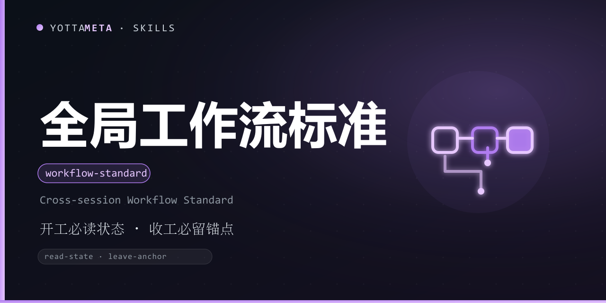

<p align="center"><b>Language</b>: English · <a href="./README.zh-CN.md">中文</a></p>

<p align="center">
  
</p>

<h1 align="center">yotta-workflow · 元序 (Yuanxu)</h1>

<p align="center">A universal workflow standard for all AI agents: <b>the process is set globally, the state is stored nearby; read the state on start, always leave a handoff anchor on finish</b>. Lets any AI conversation resume painlessly and avoids amnesia from overlong single sessions.</p>
<p align="center">State directory is unified as <code>.workflow</code> — all agent sessions of the same project read and write the same state (one source of truth); on start, read the state to restore context; while working, actively persist logs / tasks / decisions; on finish, generate a self-contained handoff anchor.</p>
<p align="center">Pure Markdown text, zero dependencies, no injection, no platform lock; install once, works across 78+ agents such as Claude Code / Codex / Cursor / OpenCode.</p>

<p align="center">
  <a href="LICENSE"></a>
  <a href="https://agentskills.io/"></a>
  <a href="https://www.npmjs.com/package/@yottameta/yotta-workflow"></a>
  <a href="https://github.com/YottaMeta/yotta-workflow"></a>
  <a href="https://github.com/YottaMeta/yotta-workflow/commits/main"></a>
  <a href="https://github.com/YottaMeta/yotta-workflow"></a>
</p>

## What it is

AI sessions are inherently stateless: each conversation is independent, and the longer a chat grows the more memory it loses; switching sessions or agents means the previous context is gone. The built-in memory solutions of each platform usually serve a single agent, so different agents each keep their own records and produce multiple "sources of truth".

yotta-workflow distills "cross-session collaboration" into an agent-agnostic protocol that answers three questions:

- **Where is the state stored and in what format?** — determined by rules, not left to each agent's free choice.
- **When to read, when to write?** — read on start, write actively while working, always leave an anchor on finish.
- **How to hand off?** — a fixed template generates a self-contained handoff anchor; the next session resumes painlessly from just that anchor.

It depends on no specific agent or platform: the state is just Markdown files under the project directory, readable and writable by any agent or tool.

## Core value

- **One source of truth** — all agent sessions of the same project read and write the same `.workflow\` state directory, instead of each building its own and keeping separate records.
- **State stored nearby** — state location is decided from the session cwd, never a hard-coded default path; a project root stores nearby, a workspace root stores per-project by name.
- **Proactive anti-amnesia** — every completed action is written to logs / tasks / decisions while working, not relied on in-conversation memory (context gets auto-compressed).
- **Self-contained handoff** — on finish, generate a fixed-format handoff anchor; the next session restores full context from the anchor plus state files.
- **Compatible with existing mechanisms** — if the project already has its own handoff / state mechanism, keep it, only satisfying two mandatory points: read state on start, update state and leave an anchor on finish.

## Core advantages

| Advantage | Description |
|---|---|
| **Cross-agent unified** | follows the Agent Skills open standard (agentskills.io); install once, 78+ agents share one state protocol |
| **One source of truth** | unified `.workflow` state directory; any agent of the same project reads/writes the same state, eliminating multiple sources of truth |
| **Automated path detection** | take cwd → decide project root vs workspace → store nearby or separated by project name; never hard-code a path |
| **Proactive persistence** | immediately write logs / tasks / decisions while working, so context compression never loses key state |
| **Self-contained handoff anchor** | fixed template + enforced validation (content must match state files); next session resumes painlessly |
| **Lightweight zero-dependency** | plain Markdown files, no daemon / database / injection; readable and writable on any platform |
| **Gradual adoption** | projects with an existing state mechanism keep it, only satisfying the two mandatory points; low migration cost |
| **Ecosystem distribution** | GitHub + npm dual-source sync release; npx / install.sh / manual copy — three install methods covering 17+ agent directories |

## Protocol details

### State file location rule (memo)

**First take the cwd, then see whether it is a project root; if it is a project root, store nearby; if it is a workspace, store per project name; the state directory is always `.workflow`, independent of the agent used; never hard-code any default / fixed path.**

| base form | state directory |
|---|---|
| project root directory (contains `.git`, project config, or explicitly pointed-to single project) | `<base>\.workflow\` |
| workspace root directory (multiple project subdirs side by side) | `<base>\<project name>\.workflow\` |

> A user-specified project directory / unified workspace root uses the user's convention as the base; if unspecified, use the session start cwd as the base.

### Project state system (five file types)

| File | Content |
|---|---|
| `STATE.md` | current progress / recent decisions / open issues / next steps (key for the next session to resume) |
| `TASKS.md` | task list (`- [ ]` todo / `- [x]` done / `- [~]` in progress) |
| `DECISIONS.md` | decision log (each with background / decision / rationale / alternatives) |
| `ROADMAP.md` | long-term goals + next-step plan |
| `logs\YYYY-MM-DD.md` | one daily log (what was done / produced / pitfalls hit) |

### Three-phase protocol

**On start (every session)** — locate the state directory by the rule → if present, fully read STATE / TASKS / ROADMAP / DECISIONS and recent logs to restore context; if absent, initialize all files and confirm with the user; a session delivers one milestone.

**While working (write actively, don't rely on memory)** — append to the day's log after each completed action; update TASKS status in real time; write directional decisions into DECISIONS on the spot; keep STATE "current progress" up to date; key info must be persisted, not left only in the conversation.

**On finish (every session)** — update STATE / TASKS / ROADMAP → append the day's log → generate a handoff anchor by template and output it verbatim for the user to copy.

### Handoff anchor format

On finish, output by the fixed template; the anchor must be self-contained and its content must match the state files (never invented). The full template is in SKILL.md "五、交接话术模板". Structure points:

| Section | Content |
|---|---|
| header | project name (one-line positioning), project root absolute path, last session end date |
| progress | current progress, completed (consistent with STATE.md) |
| next | next steps (by priority), key decisions, open issues / notes |
| footer | on start please read: `.workflow\STATE.md`, TASKS.md, ROADMAP.md |

## Usage examples

**On start** — read state, then talk about the task:

```text
Please read .workflow\STATE.md, TASKS.md, ROADMAP.md first to restore the project context.
```

**While working** — after completing one thing, persist it immediately:

```text
Completed "xxx", append to logs\2026-08-25.md; tick the TASKS.md item; update STATE.md current progress.
```

**On finish** — generate a handoff anchor by template:

```text
Handoff anchor for your next session

【会话交接锚点】
项目：<project name>（<one-line positioning>）
路径：<project root absolute path>
上次会话结束于：<date>
当前进度：…
下一步（按优先级）：…
开工请先读取：.workflow\STATE.md、TASKS.md、ROADMAP.md
```

## When to trigger

Use this skill in these scenarios:

- When starting or ending a work session, or resuming a project.
- When the project state changes (completing a task / recording a decision / updating the roadmap).
- When you need to leave a self-contained handoff anchor for the next session, or read an existing one.

It is not needed for one-off read-only questions (e.g. "what does this function mean").

## Installation

Pick any of the three methods; skill files are always fetched from **npm** (GitHub can be slow without a proxy; npm supports mirrors).

### Method 1: npm (recommended, one-liner)
```bash
# Optional China mirror: npm config set registry https://registry.npmmirror.com
npx -y @yottameta/yotta-workflow -g
npx -y @yottameta/yotta-workflow --dir <your skills dir>   # any agent: install to a custom directory
```
> Agent not in the preset list? Use `--dir` to point at its skills directory, or copy manually (Method 3). `--list` shows the default directory of each agent. To grab the files yourself, run `npm pack @yottameta/yotta-workflow` and unpack, then use Method 2 or 3.

### Method 2: install.sh
After obtaining the skill folder (`npm pack` unpack or `git clone`), enter the folder:
```bash
bash install.sh -g    # user-level; bash install.sh --list shows all directories
bash install.sh --agent codex   # a specific agent (see --list)
bash install.sh       # project-level: auto-detect existing skills directories
bash install.sh --dir /path/to/skills
```
> Covers 17 agent families, including Trae / Qwen / Comate / CodeBuddy / Kimi.

### Method 3: manual copy
Copy the whole `yotta-workflow` folder into the target agent's skills directory. Common user-level locations (`%USERPROFILE%` on Windows, `~` on Linux/macOS):

| Agent | User-level directory | Project-level directory |
|---|---|---|
| Codex | `%USERPROFILE%\.codex\skills\yotta-workflow\` | `.codex\skills\` |
| Claude Code | `%USERPROFILE%\.claude\skills\yotta-workflow\` | `.claude\skills\` |
| Cursor | `%USERPROFILE%\.cursor\skills\yotta-workflow\` | `.cursor\skills\` |
| Windsurf | `%USERPROFILE%\.codeium\windsurf\skills\yotta-workflow\` | `.windsurf\skills\` |
| opencode | `%USERPROFILE%\.config\opencode\skills\yotta-workflow\` | `.opencode\skills\` |
| Gemini | `%USERPROFILE%\.gemini\skills\yotta-workflow\` | `.gemini\skills\` |
| Goose | `%USERPROFILE%\.config\goose\skills\yotta-workflow\` | `.goose\skills\` |
| Amp | `%USERPROFILE%\.config\agents\skills\yotta-workflow\` | `.agents\skills\` |
| Kiro | `%USERPROFILE%\.kiro\skills\yotta-workflow\` | `.kiro\skills\` |
| WorkBuddy | `%USERPROFILE%\.workbuddy\skills\yotta-workflow\` | `.workbuddy\skills\` |
| Trae Code CLI | `%USERPROFILE%\.traecli\skills\yotta-workflow\` | `.traecli\skills\` |
| Trae IDE (CN) | `%USERPROFILE%\.trae-cn\skills\yotta-workflow\` | `.trae\skills\` |
| Qwen Code | `%USERPROFILE%\.qwen\skills\yotta-workflow\` | `.qwen\skills\` |
| Comate | `%USERPROFILE%\.comate\skills\yotta-workflow\` | `.comate\skills\` |
| CodeBuddy | `%USERPROFILE%\.codebuddy\skills\yotta-workflow\` | `.codebuddy\skills\` |
| Kimi | `%USERPROFILE%\.kimi\skills\yotta-workflow\` | `.kimi\skills\` |
| Generic AGENTS.md | `%USERPROFILE%\.agents\skills\yotta-workflow\` | `.agents\skills\` |

> If Codex's `CODEX_HOME` is set, it overrides the default; the same applies to opencode's `XDG_CONFIG_HOME`. `.agents\skills` is not a universal directory — only OpenCode / Cursor / Cline / Amp / Kimi / Gemini CLI / GitHub Copilot etc. read it; **Claude Code and Codex do not read it by default**. When unsure, use `--dir` or let the agent install it.

> Project-level: run `npx -y @yottameta/yotta-workflow` or `bash install.sh` inside the project to install into the detected project-level directory.

## Upgrade / uninstall

- **Upgrade**: reinstall the latest version to overwrite — `npx -y @yottameta/yotta-workflow -g` or rerun `bash install.sh -g`. Old files inside the skill directory are overwritten; the project state files (`.workflow\`) are unaffected.
- **Uninstall**: delete the `yotta-workflow` folder under the target agent's skills directory (see the table above). Uninstalling does not affect state files already written into a project.

## FAQ

- **Where is the state directory?** First check whether `.workflow\` exists under the project; if not, locate it by the "state file location rule" using the session cwd as the base.
- **Multiple agents out of sync?** Confirm they point to the same project directory (the same `.workflow\`). This skill is designed to share one state; if each built its own `.workflow`, the project directory differs.
- **Project already has its own handoff mechanism?** Keep it, only satisfying the two mandatory points: read state on start, update state and leave an anchor on finish.

## Development & checks

Run inside this project: `python tools/validate-skill.py yotta-workflow`.

## License

MIT © YottaMeta
